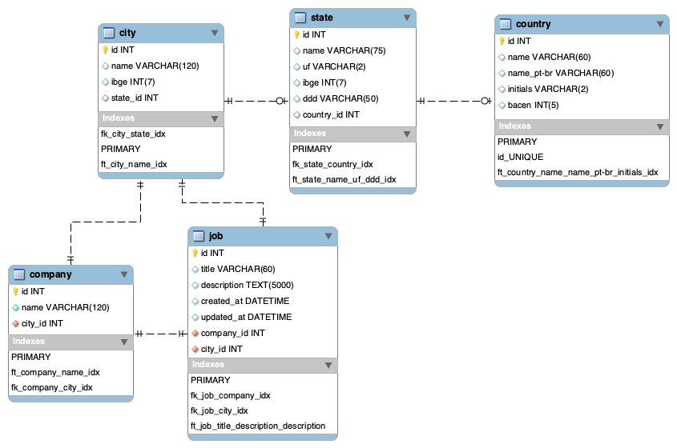

# Database

SGBD: `MySQL`

Versão: `8.0.31`

Charset: `utf8mb4`

Collate: `utf8mb4_unicode_ci`

Engine: `MyISAM`

## Diagrama ER ( [Download](../files/oamarelinho-diagrama-er.mwb) )

## Tabelas

- [country](#country)
- [state](#state)
- [city](#city)

### country

#### COUNTRY FULLTEXT KEYS

- name
- name_pt-br
- initials

SQL de todos os Países e Nações (c/ Código do Portal do Comércio Exterior ou BACEN)

> Obs.: A tabela de Países está sofrendo atualizações na coluna do Código BACEN, priorizando o código do País através da tabela de países do Portal do Comércio Exterior, sendo assim em alguns casos o código BACEN do País está recebendo o Código do Portal de Comércio Exterior, levando em consideração que a Receita Federal está exigindo essa tabela em relação ao BACEN em seus documentos fiscais. Vide Nota Técnica 2018.003 no portal da nota fiscal eletrônica.

### state

#### STATE FULLTEXT KEYS

- name
- uf
- ddd

Estados e Federações Brasileiras (com DDD e Código do IBGE)

### city

#### CITY FULLTEXT KEYS

- name

Cidades e Municípios Brasileiros (com Código do IBGE), incluindo as 31 regiões administrativas do DF, Ilhas e Áreas Remotas do Mundo.

### company

#### COMPANY FULLTEXT KEYS

- name

Empresas que oferecem oportunidades.

### job

#### JOB FULLTEXT KEYS

- title
- description

Oportunidades de emprego ofertadas.
